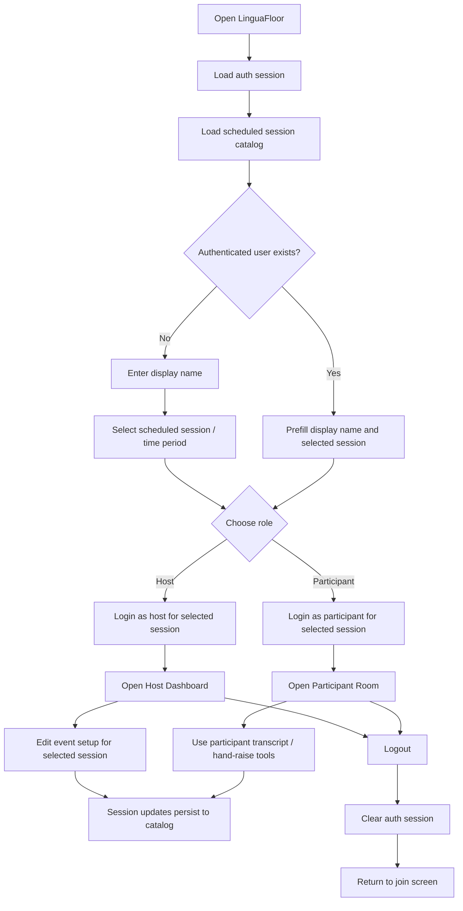

## Session access flow

This flow chart captures the current app behavior for login, scheduled-session selection, role routing, and logout.

### Notes

- One LinguaFloor app now supports multiple scheduled sessions under the same shared floor.
- Login is tied to both a role and the selected scheduled session.
- Each user has one active transcript language preference at a time.
- Transcript translations are cached once per distinct target language and shared with all users on that language.
- Logout returns the user to the join screen and clears the in-memory auth session.

